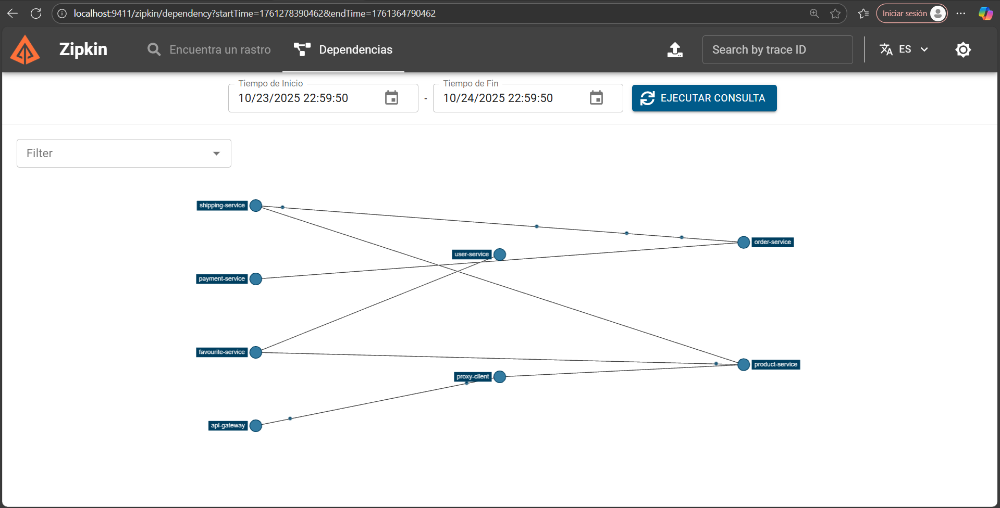
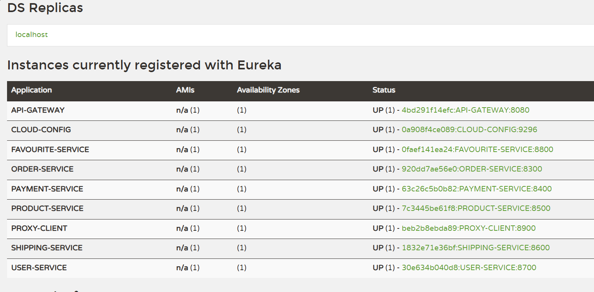
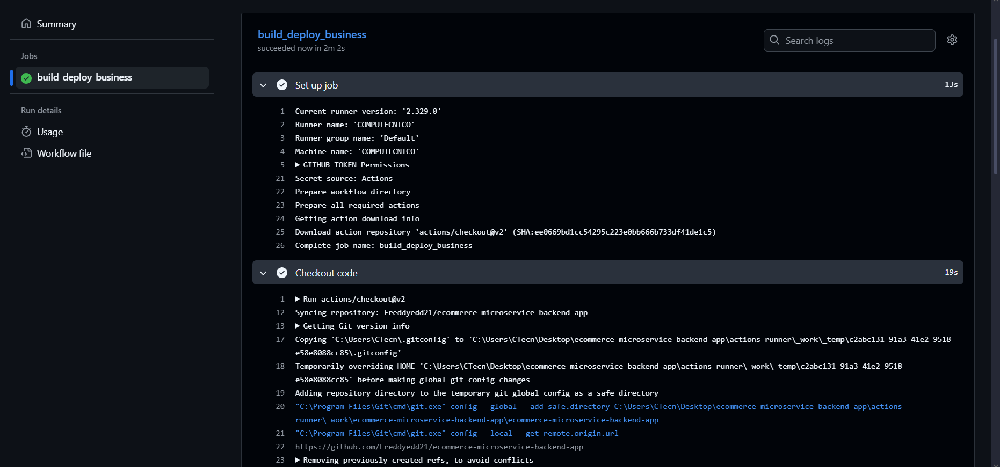
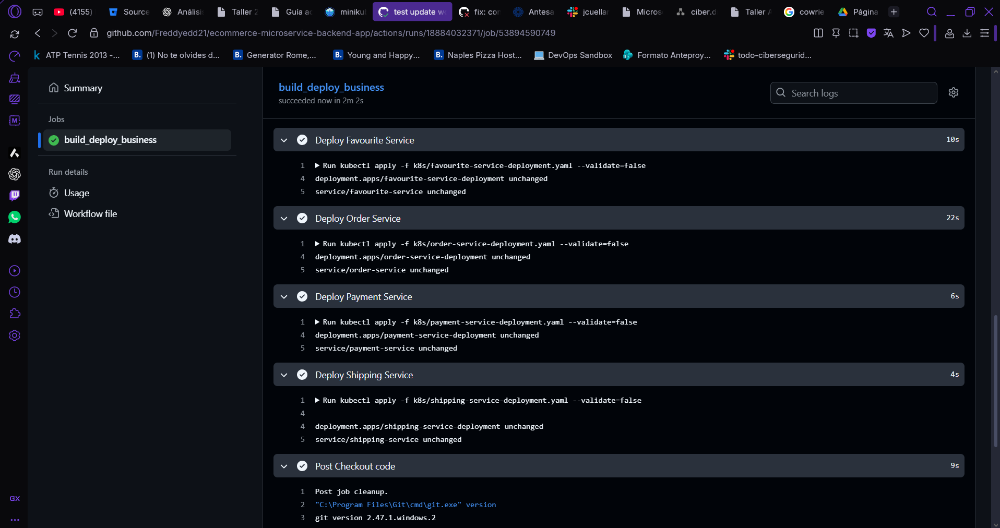
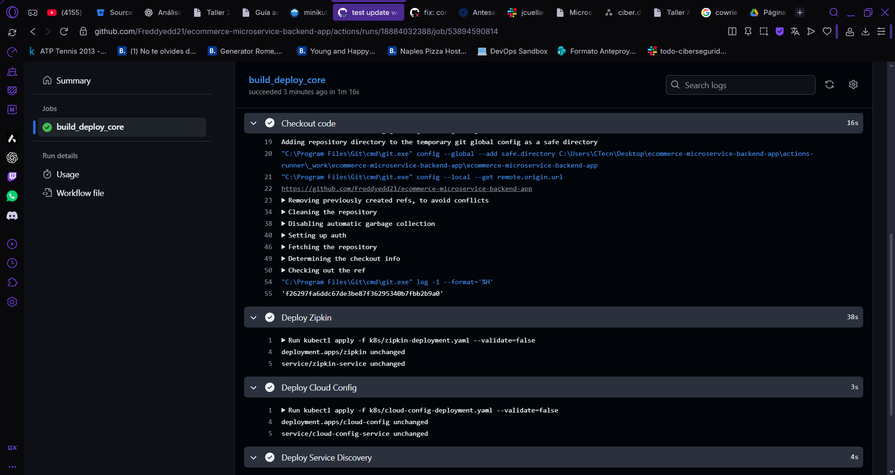
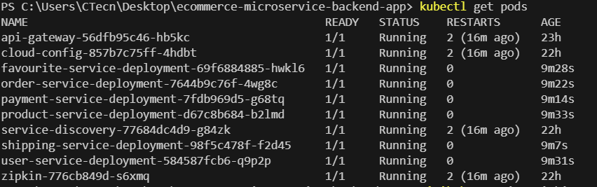
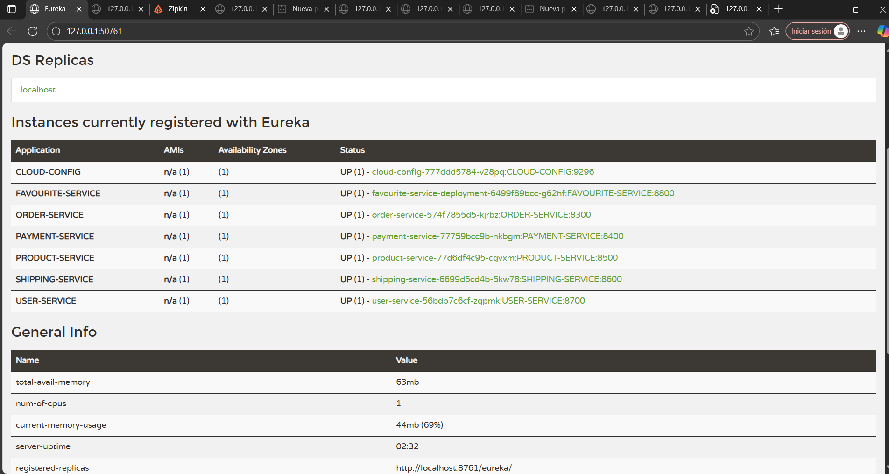
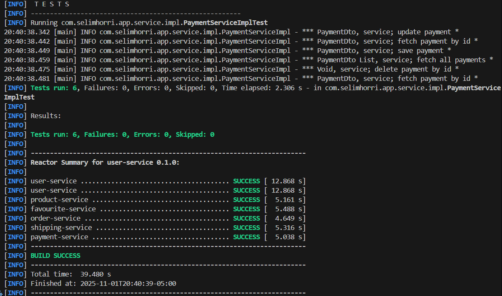
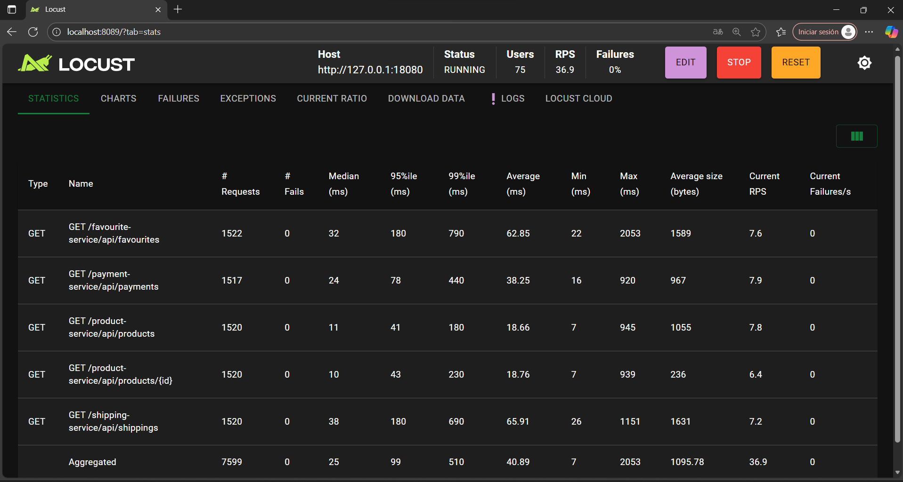

# Reporte de configuración y despliegue

## 1. Separación de archivos Compose
- Se dividió el archivo principal en tres grupos:
  - `core.yml`: servicios centrales (zipkin, cloud-config, service-discovery).
  - `compose-gateway.yml`: api-gateway y proxy-client.
  - `compose-business.yml`: microservicios de negocio (product-service, user-service, order-service, payment-service, favourite-service, shipping-service).
- Se recomendó levantar los servicios en el siguiente orden para evitar saturar la PC y asegurar dependencias:
  1. Servicios centrales
  2. Gateway y proxy
  3. Microservicios de negocio





## 2. Docker y Compose
- Se revisaron y adaptaron los Dockerfile de cada microservicio para asegurar consistencia y correcta configuración de variables de entorno.
- Se corrigieron los compose.yml individuales para que todos los servicios se conecten a la red `microservices_network` y tengan las variables necesarias para Eureka, Config Server y Zipkin.

## 3. GitHub Actions
- Se crearon workflows para los seis microservicios principales:
  - product-service
  - user-service
  - order-service
  - payment-service
  - proxy-client
  - api-gateway
- Cada workflow compila el código, construye la imagen Docker y la publica en Docker Hub.

## 4. Kubernetes
- Se generaron manifiestos de despliegue y servicio para los seis microservicios principales y los servicios centrales (Eureka, Config Server, Zipkin).
- Se recomendó reemplazar `<DOCKER_USERNAME>` por el usuario real de Docker Hub antes de desplegar.
- Se indicaron los comandos para aplicar los manifiestos en el clúster.

## 5. Recomendaciones de uso
- Mantener solo un archivo core para los servicios centrales.
- Levantar los servicios por grupos para evitar saturación de recursos.
- Verificar la salud de los servicios en Eureka y Zipkin.
- Usar los workflows de GitHub Actions para automatizar el build y despliegue.
- Usar los manifiestos de Kubernetes para el despliegue en clúster.

## 6. Automatización CI/CD y Despliegue en Kubernetes

### Workflows de GitHub Actions
- Se crearon dos workflows principales en `.github/workflows/`:
  - `core-services-pipeline.yml`: Despliega los servicios centrales (Zipkin, Cloud Config, Service Discovery) en el clúster de Kubernetes usando los manifiestos en `k8s/`.
  - `api-gateway-pipeline.yml`: Compila, construye y publica la imagen Docker del API Gateway, y luego la despliega en Kubernetes.
- Ambos workflows quedaron únicamente con el disparador manual (`workflow_dispatch`). Se desactivaron los eventos `push` y `workflow_run` para evitar despliegues automáticos cuando se hace `git push`; a partir de ahora se deben ejecutar desde la pestaña *Actions* siguiendo el orden core → gateway.
- El workflow de core despliega en el orden Zipkin → Cloud Config → Service Discovery y espera a que cada `Deployment` quede listo con `kubectl rollout status` antes de avanzar. De este modo Eureka arranca una vez que el Config Server ya expone la configuración. El job del gateway aplica el propio deployment y proxy-client, verificando su rollout antes de finalizar.
- Ambos workflows usan un runner self-hosted y requieren los secretos `DOCKER_USERNAME`, `DOCKER_PASSWORD` y `KUBECONFIG` para autenticación y acceso al clúster.
- Se añadieron pipelines específicos para entorno *stage* de los microservicios `product-service` y `user-service` (`product-service-stage.yml`, `user-service-stage.yml`). Cada pipeline:
  1. Ejecuta las pruebas unitarias del módulo (`mvnw -pl <service> -am test`).
  2. Empaqueta el servicio sin saltar pruebas.
  3. Construye y publica una imagen con tag `SHA` en Docker Hub.
  4. Aplica los manifiestos de Kubernetes ajustando el namespace a `ecommerce-stage` y fuerza la actualización del deployment con la nueva imagen.
  5. Espera el `rollout` exitoso antes de terminar.
- Estos pipelines se disparan de forma manual o con `push` a la rama `stage`. Requieren los secretos `DOCKER_USERNAME`, `DOCKER_PASSWORD` y `KUBECONFIG` del clúster.
- Actualmente despliegan sobre el namespace `ecommerce` existente, por lo que comparten ConfigMaps/Secrets con el entorno ya configurado. Si más adelante decides aislar un entorno stage, basta con ajustar la variable `KUBE_NAMESPACE` en los workflows.








### Manifiestos de Kubernetes
- Los manifiestos para Zipkin, Cloud Config y Service Discovery se encuentran en la carpeta `k8s/`:
  - `zipkin-deployment.yaml`
  - `cloud-config-deployment.yaml`
  - `service-discovery-deployment.yaml`
- Cada manifiesto define un Deployment y un Service (NodePort) para exponer los servicios en el clúster.
- El API Gateway también cuenta con sus propios manifiestos (`api-gateway-deployment.yaml`, `api-gateway-service.yaml`).

### Orden de despliegue recomendado
1. Ejecutar el workflow `core-services-pipeline.yml` para desplegar los servicios centrales.
2. Verificar que los pods y servicios estén corriendo correctamente (`kubectl get pods`, `kubectl get services`).
3. Ejecutar el workflow `api-gateway-pipeline.yml` para compilar, construir, publicar y desplegar el API Gateway.
4. Validar el acceso al API Gateway y la integración con los servicios centrales.



### Notas adicionales
- Si se requiere que el workflow del API Gateway espere a que los servicios centrales estén listos, se puede configurar una dependencia entre workflows en GitHub Actions usando `needs` o ejecutando manualmente en el orden correcto.
- Se recomienda documentar cualquier cambio en los manifiestos y workflows en este reporte para mantener trazabilidad.

## 7. Ajustes recientes para despliegue en Minikube
- Se corrigieron los valores de los ConfigMaps en `k8s/config-maps.yaml` para que `ZIPKIN_BASE_URL` apunte a `http://zipkin-service:9411` y `CONFIG_SERVER_URL` a `http://cloud-config-service:9296`, alineando los hosts con los nombres reales de los servicios dentro del clúster.
- Se actualizaron los deployments `k8s/order-service-deployment.yaml`, `k8s/payment-service-deployment.yaml`, `k8s/product-service-deployment.yaml`, `k8s/shipping-service-deployment.yaml`, `k8s/user-service-deployment.yaml`, `k8s/cloud-config-deployment.yaml` y `k8s/zipkin-deployment.yaml` para que todos consuman el Config Server mediante `http://cloud-config-service:9296/` y lean la URL de Eureka desde el ConfigMap.
- Para asegurar la detección del Config Server en Eureka, se añadieron variables de entorno alternativas (`EUREKA_CLIENT_SERVICE*_DEFAULTZONE`) y `JAVA_TOOL_OPTIONS=-Deureka.client.service-url.defaultZone=http://service-discovery-service:8761/eureka/` en los deployments de Cloud Config y Zipkin, evitando el fallback a `localhost` que usaba la configuración por defecto del repositorio Git de configuración.
- Se eliminaron temporalmente los deployments de negocio (order, payment, product, shipping, user) para aislar las pruebas de los servicios core. Próximos despliegues deberán recrearlos cuando se continúe con las pruebas integrales.
- Se agregó un controlador simple `RootController` en el proyecto `cloud-config` para responder con 200 en la raíz (`/`) y así evitar trazas de error 404 al monitorear con Zipkin. El contenedor en ejecución sigue usando la imagen publicada originalmente; solo es necesario reconstruirla si se quiere aprovechar este endpoint opcional.


---








## 8. Cobertura de pruebas unitarias en microservicios
- Se crearon suites unitarias con Mockito para los servicios de negocio que aparecen en Zipkin (`favourite-service`, `user-service`, `product-service`, `order-service`, `shipping-service`, `payment-service`). Cada prueba valida el mapeo DTO ↔ entidad, la interacción con los repositorios JPA y la integración con `RestTemplate` cuando aplica.
- Durante la implementación se detectó que las entidades y DTOs no exponen `toBuilder`; por lo tanto, las pruebas construyen instancias actualizadas explícitamente para mantener compatibilidad con Lombok y reflejar estados modificados.
- Se documentó el flujo completo de persistencia y eliminación en los servicios, incluyendo las excepciones personalizadas (`FavouriteNotFoundException`, `UserObjectNotFoundException`, etc.) para cubrir escenarios felices y de error.
- Se ejecutaron los tests con `.\mvnw.cmd -pl favourite-service,user-service,product-service,order-service,shipping-service,payment-service test`, garantizando que todas las suites compilan y pasan en cadena dentro del reactor Maven.
- La evidencia del `BUILD SUCCESS` se adjunta en la captura proporcionada, donde se observa el tiempo individual de ejecución por módulo y la ausencia de fallos.


Este reporte documenta todos los pasos y configuraciones realizadas para correr y desplegar el sistema de microservicios de manera óptima y escalable.

## 9. Validación manual servicio por servicio en Minikube

Para comprobar rápidamente la salud de cada componente dentro del clúster, se recomienda mantener abiertos los `port-forward` en sesiones independientes y validar con `curl`. Las combinaciones sugeridas evitan conflictos de puertos en la máquina local:

- **Zipkin**  
  - `kubectl port-forward deployment/zipkin -n ecommerce 19411:9411`
  - `curl http://127.0.0.1:19411/actuator/health`
  - `curl http://127.0.0.1:19411/api/v2/services`
- **Service Discovery (Eureka)**  
  - `kubectl port-forward deployment/service-discovery -n ecommerce 18761:8761`
  - `curl http://127.0.0.1:18761/actuator/health`
  - `curl http://127.0.0.1:18761/eureka/apps`
- **Cloud Config**  
  - `kubectl port-forward deployment/cloud-config -n ecommerce 19296:9296`
  - `curl http://127.0.0.1:19296/actuator/health`
  - `curl http://127.0.0.1:19296/user-service/dev`
- **User Service**  
  - `kubectl port-forward deployment/user-service -n ecommerce 18700:8700`
  - `curl http://127.0.0.1:18700/user-service/actuator/health`
  - `curl http://127.0.0.1:18700/user-service/api/users`
- **Product Service**  
  - `kubectl port-forward deployment/product-service -n ecommerce 18500:8500`
  - `curl http://127.0.0.1:18500/product-service/actuator/health`
  - `curl http://127.0.0.1:18500/product-service/api/products`
- **Favourite Service**  
  - `kubectl port-forward deployment/favourite-service-deployment -n ecommerce 18800:8800`
  - `curl http://127.0.0.1:18800/favourite-service/actuator/health`
  - `curl http://127.0.0.1:18800/favourite-service/api/favourites`
- **Order Service**  
  - `kubectl port-forward deployment/order-service -n ecommerce 18300:8300`
  - `curl http://127.0.0.1:18300/order-service/actuator/health`
  - `curl http://127.0.0.1:18300/order-service/api/orders`
- **Shipping Service**  
  - `kubectl port-forward deployment/shipping-service -n ecommerce 18600:8600`
  - `curl http://127.0.0.1:18600/shipping-service/actuator/health`
  - `curl http://127.0.0.1:18600/shipping-service/api/shippings`
- **Payment Service**  
  - `kubectl port-forward deployment/payment-service -n ecommerce 18400:8400`
  - `curl http://127.0.0.1:18400/payment-service/actuator/health`
  - `curl http://127.0.0.1:18400/payment-service/api/payments`

Mantener estos túneles activos permite lanzar rápidamente diagnósticos tipo `curl` o ejecutar la prueba de integración global sin sufrir timeouts por dependencias no accesibles.

## 10. Perfil Maven `integration` para pruebas Minikube

Se actualizó el `pom.xml` raíz con dos cambios importantes:

- El plugin `maven-surefire-plugin` excluye por defecto `MinikubeServiceCommunicationTest` de la fase `test`, de modo que `mvn test` o los builds estándar sigan ejecutándose rápido solo con los tests unitarios.
- Se creó el perfil `integration` que activa el plugin `maven-failsafe-plugin` para ejecutar `MinikubeServiceCommunicationTest` en la fase `integration-test/verify`.
- Ese plugin inyecta variables de entorno (`PRODUCT_SERVICE_BASE_URL`, `USER_SERVICE_BASE_URL`, etc.) apuntando a los puertos locales abiertos mediante `kubectl port-forward`, por lo que la prueba consume los túneles locales en lugar del DNS interno del clúster.
 - Ese plugin inyecta variables de entorno (`PRODUCT_SERVICE_BASE_URL`, `USER_SERVICE_BASE_URL`, etc.) apuntando a los puertos locales abiertos mediante `kubectl port-forward`, por lo que la prueba consume los túneles locales en lugar del DNS interno del clúster.

Uso recomendado:

```powershell
mvn -Pintegration verify
```

Antes de lanzar el comando, asegurarse de tener vivos todos los `port-forward` listados en la sección anterior para evitar fallos de conectividad durante la prueba. El resultado se puede revisar en `target/surefire-reports/TEST-com.selimhorri.app.integration.MinikubeServiceCommunicationTest.xml` o directamente en la consola Maven.


### Tutorial rápido: ejecutar la prueba de integración

1. Abre los túneles necesarios (un terminal por puerto) siguiendo la tabla de la sección 9. Revisa que cada `curl` responda 200.
2. Desde la raíz del repo ejecuta una compilación limpia del módulo raíz si vienes de un `clean` previo:
  ```powershell
  mvn --% -Pintegration -pl :ecommerce-microservice-backend -am compiler:testCompile
  ```
  Este paso recompila los tests en `src/test/java`.
3. Lanza la suite completa (unitarias + integración + E2E) con:
  ```powershell
  mvn -Pintegration verify
  ```
4. Los reportes de Failsafe se generan en `target/failsafe-reports/` y los de Surefire en cada módulo (`<module>/target/surefire-reports/`).
5. Ante un fallo de conectividad, revisa primero los `port-forward` y vuelve a ejecutar el comando.

## 11. Nuevas pruebas E2E orientadas al flujo de usuario

- Se añadió el archivo `src/test/java/com/selimhorri/app/e2e/UserJourneyE2ETest.java` con cinco casos que validan escenarios de usuario extremo a extremo a través del API Gateway (catálogo de productos, detalle, favoritos enriquecidos, resumen de envíos y estado de pagos).
- Para ejecutarlas es necesario abrir un túnel adicional hacia el gateway: `kubectl port-forward deployment/api-gateway -n ecommerce 18080:8080`. El plugin Failsafe expone esta URL a los tests mediante `API_GATEWAY_BASE_URL`.
- Las pruebas se ejecutan junto con la suite de integración existente utilizando el mismo comando `mvn -Pintegration verify`. El reporte consolidado queda disponible en `target/failsafe-reports/`.
- Se reforzó el test para entornos inestables: el `RestTemplate` ahora usa timeouts más generosos (30 s de conexión y 45 s de lectura) y reintenta hasta tres veces las llamadas al gateway antes de fallar, minimizando falsos positivos cuando los `port-forward` tardan en responder.




### Tutorial rápido: ejecutar solo las E2E

1. Asegúrate de tener activos los `port-forward` hacia todos los servicios y, en especial, al API Gateway (`18080:8080`).
2. Recompila las clases de test en caso de haber hecho `clean`:
  ```powershell
  mvn --% -Pintegration -pl :ecommerce-microservice-backend -am compiler:testCompile
  ```
3. Ejecuta únicamente el E2E filtrando por nombre y excluyendo la suite de Minikube:
  ```powershell
  mvn --% -Pintegration "-Dfailsafe.includes=**/UserJourneyE2ETest.java" "-Dfailsafe.excludes=**/MinikubeServiceCommunicationTest.java" verify
  ```
4. Observa en consola la traza `Running com.selimhorri.app.e2e.UserJourneyE2ETest` y verifica el archivo `target/failsafe-reports/TEST-com.selimhorri.app.e2e.UserJourneyE2ETest.xml`.
5. Vuelve a `mvn -Pintegration verify` sin filtros para ejecutar ambas suites juntas.

## 12. Pruebas de rendimiento con Locust

- Se agregó la carpeta `load-testing/` con `locustfile.py`, que reproduce las mismas jornadas del E2E (catálogo, detalle, favoritos, envíos y pagos) para medir desempeño desde el API Gateway.
- Cada tarea valida que las respuestas incluyan los campos clave (`collection`, `product`, `order`, etc.) y registra fallos si la API responde con estado inesperado o JSON inválido.
- El archivo `load-testing/README.md` documenta los prerequisitos y comandos para ejecutar Locust de forma interactiva y headless, incluyendo ejemplos con exporte CSV/HTML.
- Para evitar conflictos de entorno se recomienda usar `py -3.13 -m locust -f load-testing/locustfile.py` y mantener activos los `port-forward` hacia el gateway y los microservicios.
- Se sugirió una estrategia escalonada para las pruebas: comenzar con 10 usuarios (ramp-up 2/s) y aumentar progresivamente a 25, 50, 75 usuarios monitoreando RPS, latencias P95/P99 y métricas de los pods (`kubectl top pod -n ecommerce`).