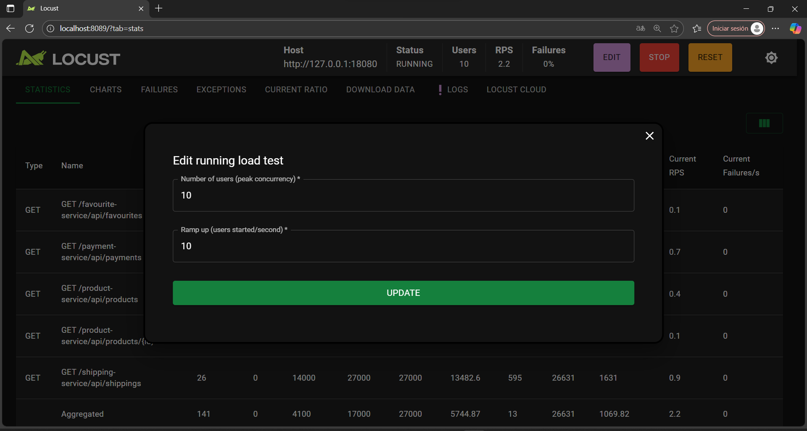

# Load Testing with Locust

This folder contains a Locust scenario that exercises the key API Gateway user journeys end-to-end. Each virtual user executes the same flow validated by the integration and E2E suites:

1. Browse the product catalogue and capture a product id.
2. Fetch the product details.
3. Review the favourites list with resolved user/product data.
4. Inspect the shipping summary for embedded order/product payloads.
5. Check the payment status entries.

## Prerequisites

- Minikube services running and the port-forward for the API Gateway active (`kubectl port-forward svc/api-gateway-service 18080:8080 -n ecommerce`).
- Python 3.9+ with `pip` available.
- Locust installed (`pip install locust`).

> The Locust file defaults to `http://127.0.0.1:18080` but you can override the host by exporting `API_GATEWAY_BASE_URL`.

## Running Locust (interactive UI)

```powershell
cd load-testing
locust -f locustfile.py
```

Open the web UI (http://localhost:8089), set the number of users/spawn rate, and start the test.

## Running Locust headlessly (CI-friendly)

```powershell
cd load-testing
locust -f locustfile.py --headless -u 50 -r 5 --run-time 10m --stop-timeout 30
```

- `-u 50`: simulate 50 concurrent virtual users.
- `-r 5`: ramp up 5 users per second.
- `--run-time 10m`: run for 10 minutes.
- `--stop-timeout 30`: give users time to finish their current journey before shutdown.

After the run completes, Locust prints aggregate stats to the console and writes a CSV report when additional flags (`--csv`) are provided. You can also enable HTML reports:

```powershell
locust -f locustfile.py --headless -u 50 -r 5 --run-time 10m --csv results --html results.html
```

The scenario uses 45-second request timeouts and retries internally on gateway calls, matching the resilience added to the E2E test.
